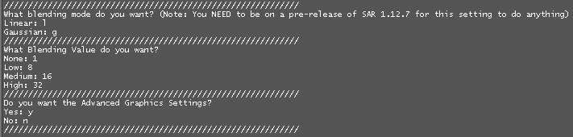

# Rendering-Configs

Easy to use rendering configs for Portal 2 demos.

## Introduction

Here are some feature highlights:

-   **Customisation**: Includes a config file which allows you to dynamically edit values from within the game.
-   **Props**: Makes any props in your demos look silky smooth
-   **Motion Blur**: Has the ability to frameblend your 34.2 Portal Gun demo so that it almost looks good.

## How to

Simply download the latest release and extract the zip.
From here you have two options:

-   **Main Configs**
-   **My Personal Preset**

### Main Configs

Place the contents of the render_custom folder into your Portal 2 cfg folder; usually located at `..\Steam\steamapps\common\Portal 2\portal2\cfg`.
Exec the configs in game by typing `exec render_main`, and from there, simply follow the on screen instructions.

### My Personal Preset

Place render.cfg into your Portal 2 cfg folder; usually located at `..\Steam\steamapps\common\Portal 2\portal2\cfg`.
Exec the preset in game by typing `exec render`.

## Bug Reports

**Only bug reports from Main Configs will be accepted.** 
Open an issue here on github. 
Contact me on discord at fin#6129. 
Cry about it.

## Make me render the demo for you

Don't abuse this too much, I have a life (no I don't lol) 
https://forms.gle/yLAii8A9nyUBS9sY8

## License

This work is licensed under a
[Creative Commons Attribution-NonCommercial-ShareAlike 4.0 International License][cc-by-nc-sa].
